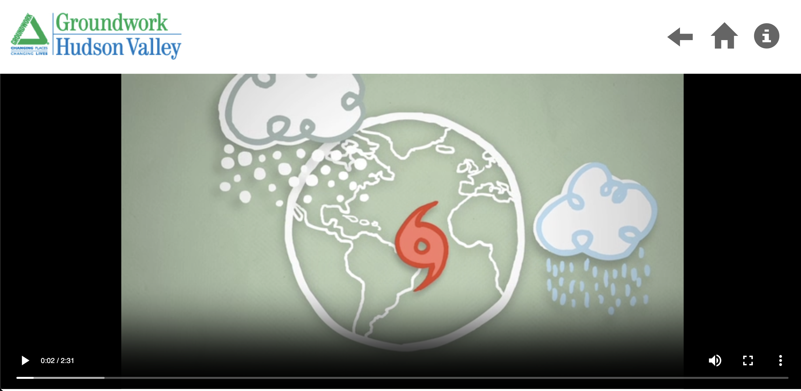

# GHV-data
The intent of this application is to serve information related to weather and the environment in order to educate the public about climate change.  The specific data presented is generated by the Science Barge in Yonkers, NY.  Groundwork Hudson Valley is the program responsible for promoting and maintaining the science barge.
Work was down in close collaboration with local developers.

## Screenshoots
The application itself is run full screen on a touch computer on the science barge in the Hudson River. Here is what it looks like!

The content was curated from a variety of sources and presented as maps, videos, and slideshows.

## Dev Instructions
* Run `npm start`  to begin the webpack to watch for file changes
* cd into the public directory and run a local server `python -m http.server 9090`
* navigate to `localhost:9090` in your browser
